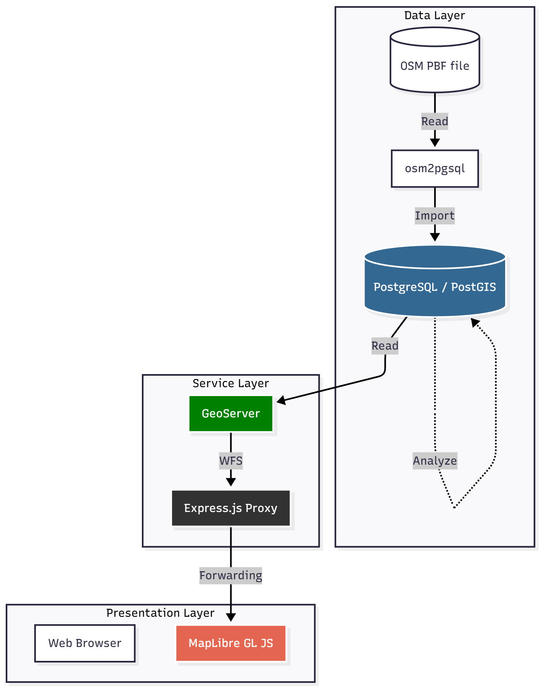

# Tempo 30 Zones Analysis

Automated identification and visualization of Tempo 30 (30 km/h / 20 mph) zones based on OpenStreetMap (OSM) data and PostGIS analysis.
A Node.js proxy is included to bypass CORS restrictions between the browser and GeoServer.

## Core components

This project integrates several tools for importing, analyzing, and serving geospatial data:

| Component      | Layer        | Purpose                                                 |
| :------------- | :----------- | :------------------------------------------------------ |
| **osm2pgsql**  | Data         | Imports OSM data into PostgreSQL.                       |
| **PostGIS**    | Data         | Stores OSM geometries and performs spatial analysis.    |
| **GeoServer**  | Service      | Exposes analysis results as a WFS.                      |
| **Express.js** | Service      | Provides a CORS-bypassing proxy for WFS requests.       |
| **MapLibre**   | Presentation | Displays the identified Tempo-30 segments on a web map. |

## Installation and setup

### 1. Install OSGeoLive as a virtual machine

### 2. Initialize setup

Run the setup script to install all dependencies:

```bash
bash setup.sh
```

### 3. Start application

Start the analysis stack:

```bash
bash start.sh
```

---

## Tempo 30 zone logic

The classification of road segments follows a multi-stage spatial logic based directly on OSM tagging and neighborhood analysis.

### 1. Eligible roads

Only roads meeting all of the following criteria are evaluated:

* Road class in: `highway=primary`, `highway=secondary`, and `highway=tertiary`.
* Not a living street: `highway!=living_street`
* No existing valid 30-zone tagging. Ignored cases include:
  * Numeric `maxspeed > 30`
  * Non-numeric `maxspeed` not in: `DE:zone:30`, `DE:zone:20`, `walk`, `DE:living_street`

### 2. Primary zone identification

A road segment becomes a Tempo 30 candidate if at least one of the following applies:

#### A. Automatic assignment

* **Residential roads:**
  All `highway=residential` segments are automatically classified as Tempo 30.

#### B. Social facilities (protective zones)

Applies to `highway=primary`, `highway=secondary`, and `highway=tertiary`.

A segment qualifies if it lies **within 50 m** *and* **within 150 m** of one or more of the following:

* Schools: `amenity=school`
* Kindergartens: `amenity=kindergarten`, `amenity=childcare`
* Senior & care facilities: `nursing_home`, `hospital`, `social_facility` with `social_facility:for=senior`
* Playgrounds: `leisure=playground`
* Pedestrian crossings: `highway=crossing` with `crossing=zebra` or `crossing_ref=zebra`

#### C. Noise protection (residential exposure)

Applies to `highway=primary`, `highway=secondary`, and `highway=tertiary`.

A segment qualifies if it lies **within 15 m** of residential buildings:

* `building=residential`
* `building=apartments`
* `building=house`
* `building=terrace`

### 3. Zone extension (network consistency)

After primary segments are determined, zones are extended for consistency:

* **Protected zone length:**
  Identified segments are treated as 300 m protected corridors.

* **Gap filling:**
  If two Tempo-30 corridors are **less than 500 m apart**, the intermediate road segment is also classified as Tempo 30.

This produces continuous, real-world-aligned Tempo-30 areas instead of isolated fragments.

---

# Architecture


